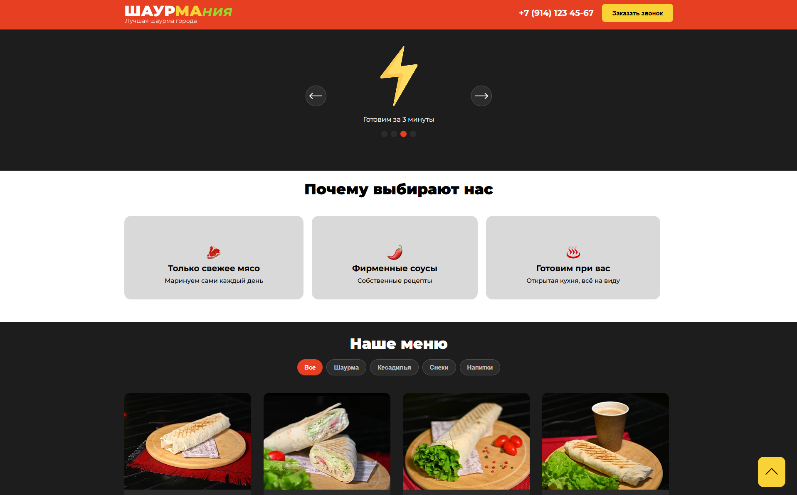

# Шаурмания — Flask-версия

Flask-приложение на основе статичного лендинга [mshqq/shaurmania](https://github.com/mshqq/shaurmania) — учебного проекта второго семестра. Оригинал — чистый HTML/CSS/JS без фреймворков; здесь к нему добавлен Python-бэкенд на базе SQLite с веб-формами, API каталога/заказов, механизмом подписок и аутентификацией.



## Что добавлено поверх шаблона

| Оригинал ([mshqq/shaurmania](https://github.com/mshqq/shaurmania)) | Эта версия |
|------|------|
| Статичный HTML-лендинг | Flask-приложение (модульная структура Flask Package) |
| Вёрстка формы подписки | Сохранение подписчиков в БД + генерация токенов для отписки |
| Только вёрстка товаров/заказов | Архитектура БД (модели продуктов, категорий, точек выдачи и заказов) + API-эндпоинты |
| Нет системы пользователей | Аутентификация через Flask-Login (модель User, login/logout) |
| Деплой через GitHub Pages | Запуск через Flask-сервер / Docker |

Интерфейс разделён на общий базовый шаблон, шаблоны страниц и отдельные CSS/JS-модули.

## Возможности

- просмотр каталога товаров с фильтрацией по категориям;
- корзина и оформление заказа с выбором самовывоза или доставки;
- отдельная страница заказа по публичному токену;
- автоматическая смена статуса заказа: «accepted» → «cooking» → «pending» → «done»;
- форма подписки на акции;
- аутентификация пользователей (логин/пароль) для доступа к админ-эндпоинтам;
- адаптивная вёрстка и интерактивные элементы интерфейса.

## Стек

- **Python 3.12 / Flask / Flask-SQLAlchemy** — бэкенд, роутинг, ORM-модели
- **Flask-Login** — аутентификация и сессии пользователей
- **Flask-WTF / WTForms** — валидация формы подписки + CSRF-защита
- **SQLite** — локальная СУБД для хранения данных
- **APScheduler** — автоматическая смена статусов заказов по времени
- **smtplib (опционально)** — отправка HTML-писем через Gmail SMTP (код находится в `mail.py`, в маршрутах по умолчанию закомментирован)
- **python-dotenv** — секреты и настройки через `.env`
- **Docker** — контейнеризация приложения
- **HTML / CSS / JavaScript** — адаптированный фронтенд из оригинального шаблона

## Быстрый старт

1. Склонируйте репозиторий:
```bash
git clone <url-репозитория>
cd ShaurmaniaApp
```

2. Настройте виртуальное окружение и установите зависимости:
```bash
python -m venv venv
venv\Scripts\activate        # Windows
# source venv/bin/activate   # macOS / Linux

pip install -r requirements.txt
```

3. Создайте файл `.env` в корне проекта (см. `.envexample`):
```env
SECRET_KEY=any-random-string
app_password=your-gmail-app-password
MAX_TOKEN=your-max-bot-token
USER_ID=your-max-user-id

FLASK_DEBUG=1
FLASK_HOST=0.0.0.0
FLASK_PORT=5000
```

| Переменная | Назначение |
|---|---|
| `SECRET_KEY` | Секретный ключ Flask (обязательно) |
| `app_password` | [Пароль приложения Gmail](https://myaccount.google.com/apppasswords) для отправки писем (опционально) |
| `MAX_TOKEN` | Токен бота платформы MAX для уведомлений (опционально) |
| `USER_ID` | ID пользователя MAX для рассылки (опционально) |
| `FLASK_DEBUG` | Режим отладки (`1` — вкл., `0` — выкл.) |
| `FLASK_HOST` | Хост сервера (по умолчанию `127.0.0.1`) |
| `FLASK_PORT` | Порт сервера (по умолчанию `5000`) |

4. Запустите Flask-сервер:
```bash
python app.py
# → http://127.0.0.1:5000
```
При первом запуске база данных SQLite (`instance/shaurmania.db`) и все таблицы будут созданы автоматически.

5. Создайте администратора (для доступа к защищённым эндпоинтам):
```bash
python scripts/create_admin.py
```

### Запуск через Docker

```bash
docker build -t shaurmania .
docker run -p 5000:5000 --env-file .env shaurmania
```

---

## Структура проекта

```
ShaurmaniaApp/
├── app.py                       # Точка запуска (вызывает create_app())
├── mail.py                      # Отправка писем через Gmail SMTP (отдельный скрипт)
├── requirements.txt             # Зависимости проекта
├── Dockerfile                   # Конфигурация Docker-контейнера
├── .env                         # Переменные окружения (не коммитится в Git)
├── .envexample                  # Пример переменных окружения
├── scripts/
│   └── create_admin.py          # CLI-скрипт создания администратора
├── app/                         # Основной пакет приложения
│   ├── __init__.py              # Инициализация Flask, БД, CSRF и LoginManager
│   ├── extensions.py            # Объявление расширений (SQLAlchemy, CSRFProtect, LoginManager)
│   ├── forms.py                 # Классы форм (SubscriptionForm)
│   ├── models.py                # Модели БД (Location, Category, Product, Order, OrderItems, Subscriber, User)
│   ├── utils.py                 # Утилиты (конвертация времени UTC → локальное)
│   ├── routes/                  # Blueprint-обработчики страниц и API
│   │   ├── main.py              # Главная страница
│   │   ├── products.py          # API каталога
│   │   ├── orders.py            # API и страница заказа
│   │   ├── locations.py         # API точек самовывоза
│   │   ├── subscribers.py       # Подписки и рассылки
│   │   └── auth.py              # Аутентификация (login / logout)
│   ├── templates/               # HTML-шаблоны
│   │   ├── base.html            # Общий шаблон с header/footer
│   │   ├── index.html           # Главная страница
│   │   ├── order.html           # Страница заказа
│   │   ├── 404.html             # Страница ошибки
│   │   └── email_subscription.html
│   └── static/                  # CSS, JavaScript-модули и изображения
└── instance/                    # Папка с локальной базой данных SQLite (создаётся при запуске)
    └── shaurmania.db
```

---

## База данных и API-эндпоинты

В приложении спроектирована база данных с моделями SQLAlchemy:
* `User` — пользователи системы (логин, email, хэш пароля); используется Flask-Login.
* `Subscriber` — подписчики рассылки с уникальным UUID-токеном безопасности.
* `Category` и `Product` — список товаров и категорий.
* `Order` и `OrderItems` — заказы и состав (товары, количества); статусы заказов обновляются планировщиком автоматически.
* `Location` — адреса ресторанов.

### API Эндпоинты

* **Каталог и заказы:**
  * `GET /api/products` — возвращает список всех товаров в формате JSON.
  * `GET /api/locations` — возвращает список ресторанов.
  * `POST /api/locations` — создаёт точку самовывоза (требует авторизации).
  * `POST /api/order` — создаёт заказ и возвращает URL страницы заказа.
  * `GET /order/<token>` — отображает страницу заказа по публичному токену.
  * `GET /api/order/<token>` — возвращает данные заказа в формате JSON.
  * `GET /api/order/status/<token>` — возвращает текущий статус заказа.
  * `GET /api/orders` — возвращает список всех заказов и их позиций (требует авторизации).
  * `GET /debug` — страница отладки / проверки базового шаблона (требует авторизации).

* **Аутентификация:**
  * `POST /login` — вход в систему (JSON: `username`, `password`).
  * `POST /logout` — выход из системы (требует авторизации).

* **Подписки и рассылки:**
  * `POST /api/subscribe` — принимает JSON с `name` и `email`, валидирует и сохраняет запись в БД `Subscriber`.
  * `GET /unsubscribe/<token>` — отписывает пользователя от рассылки по его уникальному UUID-токену.
  * `GET /admin/subscribers` — JSON-список всех активных подписчиков (требует авторизации).

> **Как включить реальную отправку писем на почту:** раскомментируйте импорт `sendEmail` и строки вызова `sendEmail(app_password, name, email)` в файле `app/routes/subscribers.py`, указав корректные параметры доступа в файле `.env` и отправителя в `mail.py`.
